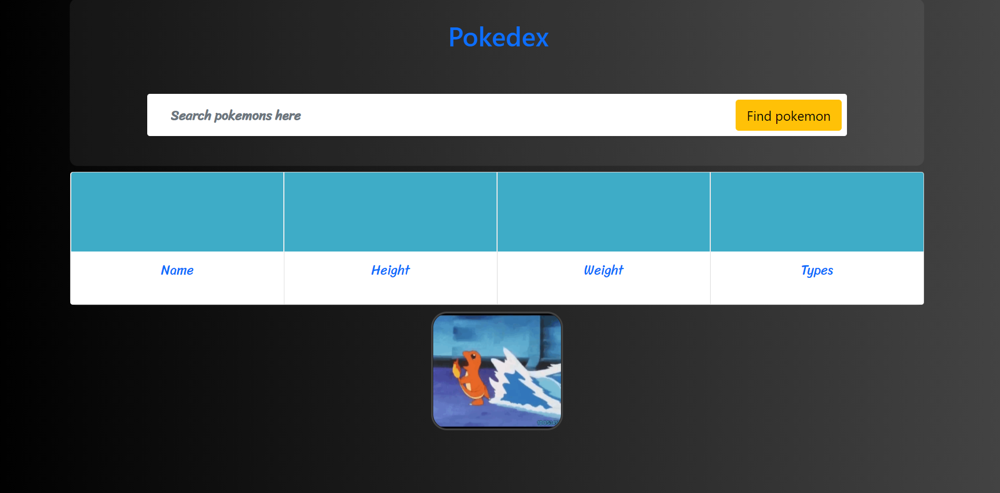

# Pokedex-back-and-front
# Pokedex

- link to the GitHub page - https://sagigolan8.github.io/Pokedex/
  

## Pokedex Task

In this task you will build your own pokédex!
Read,learn and use https://pokeapi.co/

Feel free to get inspired to start working from the [demo](https://murmuring-cove-95500.herokuapp.com/)

## Setup:

- ✔ Create a new repo called "pokedex" using the Skelton defined here.
- ✔ Work on your brunch.
- ✔ Create a PR and submit it in the classroom.

Use axios to fetch the pokeAPI.

## ✔ Pokedex implements

- ✔ Read about cross origion and way to handle it.
- ✔ Use [this](https://chrome.google.com/webstore/detail/cors-unblock/lfhmikememgdcahcdlaciloancbhjino?hl=en) chrome extenstion for unblock cross origion when working on local file.
- ✔ Show Pockemon name height weight and image on search id.
- ✔ Make the image change to back_default on hover.
- ✔ Support search by name ([HINT](https://pokeapi.co/docs/v2#pokemon))
- ✔ Add not found message if the API return it (case the pockemon doesnt exist).
- ✔ Show list of types names for each pockemon.
- ✔ On click on one of the pockemon types show list of all the pokemons names that related to this type ([HINT](https://pokeapi.co/docs/v2#type:~:text=lines))).
- ✔ On Click on one of the pockemon name change the pokedex context by changing the input value to the name of the pockemon.

## Bonuses:

- ✖ Use fetch insted of axios in two functions.
- ✔ Use bootstrap for efficient and easy design.
- ✔ Add design and features of your choice:

- Responsive web design.
- Auto scroll when the user clicks on pokemon type.
- User allowd to search some pokemon by pressing "Enter" in the search bar.
